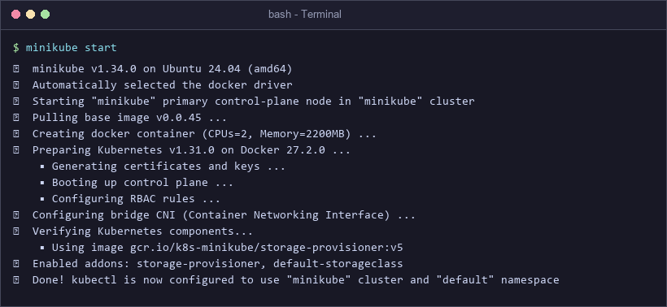
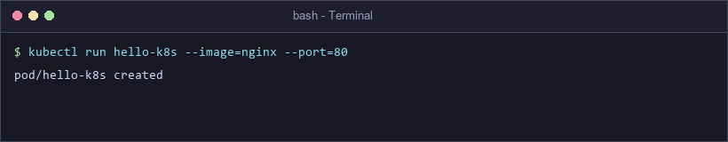
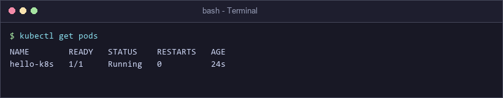
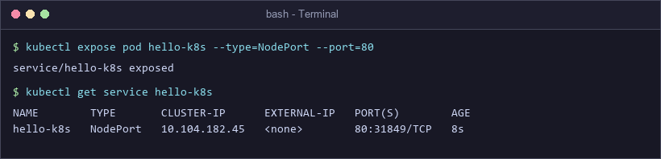
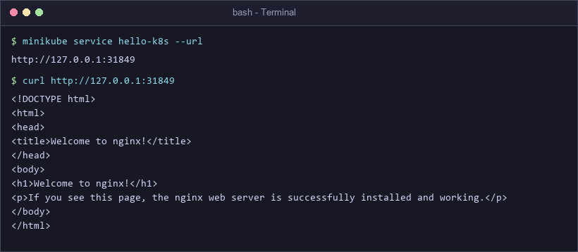

# Exercise 1: Kubernetes Getting Started (Hello Pod)

## Business Scenario (Zepto Storefront Example)
Imagine you are a **DevOps Engineer at Zepto**. The product team built a lightweight web app displaying storefront product listings and customer delivery tracking pages. Your task is to **deploy this web app on Kubernetes** so that it remains portable, highly available, and ready to scale. For this exercise, we simulate the storefront web application using an `nginx` container image.

---

## 🎯 Objectives & Goals
- Understand Kubernetes core primitives (**Node**, **Pod**, **Service**).
- Spin up a single-node local Kubernetes cluster using **Minikube**.
- Deploy an `nginx` container as a Kubernetes **Pod**.
- Expose the running Pod to host networking via a **NodePort Service**.
- Verify external HTTP application connectivity.

---

## 🛠️ Prerequisites & Installation

### 1. Install Minikube
- **Windows (PowerShell as Administrator)**:
  ```powershell
  choco install minikube
  ```
- **Linux / WSL**:
  ```bash
  curl -LO https://storage.googleapis.com/minikube/releases/latest/minikube-linux-amd64
  sudo install minikube-linux-amd64 /usr/local/bin/minikube
  ```
- **macOS (Homebrew)**:
  ```bash
  brew install minikube
  ```

---

## 🚀 Step-by-Step Exercise Execution

### Step 1: Start Minikube Cluster
Initialize a local Kubernetes cluster using Docker driver.
```bash
minikube start
```


---

### Step 2: Deploy Nginx Image as a Pod
Deploy the storefront container onto the cluster.
```bash
kubectl run hello-k8s --image=nginx --port=80
```


---

### Step 3: Verify Pod Status
Check if the Pod is running cleanly.
```bash
kubectl get pods
```


---

### Step 4: Expose the Pod as a Service
Expose port 80 of the Pod using a `NodePort` service type.
```bash
kubectl expose pod hello-k8s --type=NodePort --port=80
```


---

### Step 5: Access the Web Application
Retrieve the URL mapped by Minikube and test HTTP connectivity via `curl`.
```bash
minikube service hello-k8s --url
curl http://127.0.0.1:31849
```


---

## 📐 Kubernetes System Architecture & Internals
```
+--------------------------------------------------------------------------------+
|                                  MINIKUBE NODE                                 |
|                                                                                |
|   +------------------------------------------------------------------------+   |
|   |                        KUBERNETES CONTROL PLANE                        |   |
|   |   [ API Server ] ---- [ Scheduler ] ---- [ Controller Manager ]        |   |
|   +------------------------------------------------------------------------+   |
|                                        |                                       |
|                                        v                                       |
|   +------------------------------------------------------------------------+   |
|   |                             NODEPORT SERVICE                           |   |
|   |                             (Port: 31849)                              |   |
|   +------------------------------------------------------------------------+   |
|                                        |                                       |
|                                        v                                       |
|   +------------------------------------------------------------------------+   |
|   |                              POD: hello-k8s                            |   |
|   |   +----------------------------------------------------------------+   |   |
|   |   |                   Container: nginx (Port: 80)                  |   |   |
|   |   +----------------------------------------------------------------+   |   |
|   +------------------------------------------------------------------------+   |
+--------------------------------------------------------------------------------+
```

---

## 📄 Declarative Manifest Alternative (`nginx-pod.yaml`)
Instead of imperative `kubectl run` commands, you can apply declarative YAML:
```yaml
apiVersion: v1
kind: Pod
metadata:
  name: hello-k8s
  labels:
    app: hello-k8s
spec:
  containers:
  - name: nginx
    image: nginx:latest
    ports:
    - containerPort: 80
---
apiVersion: v1
kind: Service
metadata:
  name: hello-k8s
spec:
  type: NodePort
  selector:
    app: hello-k8s
  ports:
  - port: 80
    targetPort: 80
```
To deploy:
```bash
kubectl apply -f nginx-pod.yaml
```

---

## ❓ Questions & Answers

**Q1: What is a Kubernetes Pod?**  
*A1:* A Pod is the smallest deployable computing unit in Kubernetes, wrapping one or more co-located containers that share network storage and IP space.

**Q2: What is the purpose of `kubectl expose`?**  
*A2:* It creates a Kubernetes Service resource that provides networking, load balancing, and port forwarding to access one or more Pods.

**Q3: What does `--type=NodePort` do?**  
*A3:* It allocates a high-range static port (30000-32767) on each Node IP, enabling external traffic to route directly into the Service and Pod.
