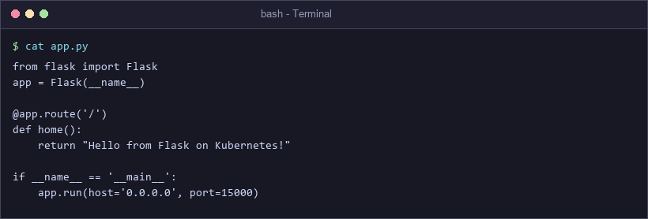
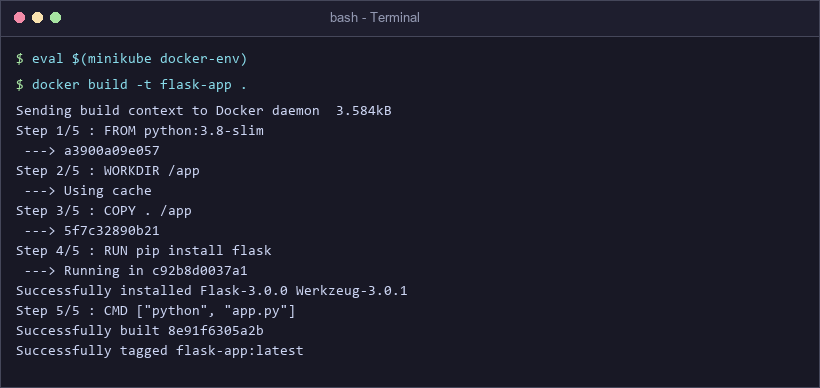
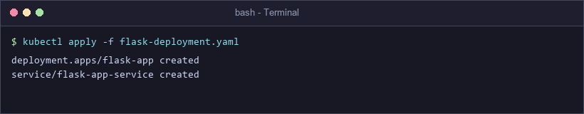
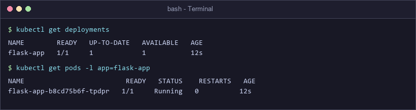
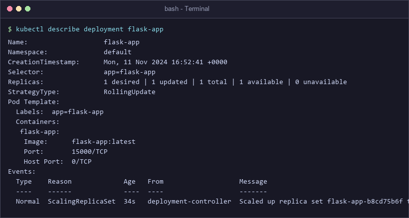
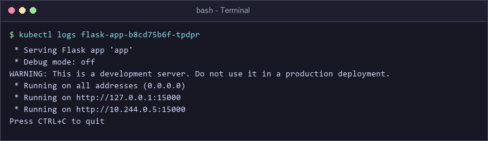
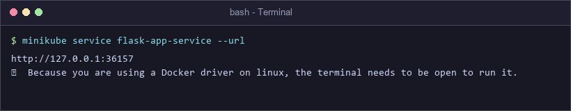
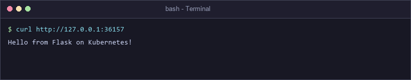

# Exercise 2: Deploy a Flask App on Minikube using kubectl and YAML

## 🎯 Objective
Learn Kubernetes fundamentals by creating a custom Python Flask application, building a container image using Minikube's internal Docker daemon, and deploying the containerized workload using declarative Kubernetes Deployment and NodePort Service manifests.

---

## 🛠️ Minikube Frequently Used Commands
```bash
minikube start                                  # Start Minikube cluster
minikube stop                                   # Stop cluster
minikube delete                                 # Delete cluster
minikube status                                 # Check cluster status
eval $(minikube docker-env)                     # Direct Docker CLI to Minikube daemon
minikube service <service-name> --url           # Retrieve external URL for service
minikube dashboard                              # Launch Kubernetes Dashboard UI
```

---

## 🚀 Step-by-Step Exercise Execution

### Step 1: Start Minikube
Start your local single-node cluster.
```bash
minikube start
```

---

### Step 2: Create Python Flask Application (`app.py`)
Write a lightweight Flask application returning `"Hello from Flask on Kubernetes!"` on port `15000`.
```python
from flask import Flask
app = Flask(__name__)

@app.route('/')
def home():
    return "Hello from Flask on Kubernetes!"

if __name__ == '__main__':
    app.run(host='0.0.0.0', port=15000)
```


---

### Step 3: Create Dockerfile
Define container build context using `python:3.8-slim`.
```dockerfile
FROM python:3.8-slim
WORKDIR /app
COPY . /app
RUN pip install flask
CMD ["python", "app.py"]
```

---

### Step 4: Build Image inside Minikube's Docker Daemon
Point local Docker client to Minikube's Docker daemon and build the image locally without pushing to Docker Hub.
```bash
eval $(minikube docker-env)
docker build -t flask-app .
```


---

### Step 5: Create Declarative Kubernetes Manifest (`flask-deployment.yaml`)
> **💡 Key Concept: `imagePullPolicy: Never`**
> - **Always**: Kubernetes forces pulling image from remote registry on every pod start.
> - **IfNotPresent**: Pulls image only if not available on host node.
> - **Never**: Prevents pulling from remote registries; forces Kubernetes to use local image built inside Minikube's Docker daemon.

```yaml
apiVersion: apps/v1
kind: Deployment
metadata:
  name: flask-app
spec:
  replicas: 1
  selector:
    matchLabels:
      app: flask-app
  template:
    metadata:
      labels:
        app: flask-app
    spec:
      containers:
      - name: flask-app
        image: flask-app:latest
        imagePullPolicy: Never
        ports:
        - containerPort: 15000
---
apiVersion: v1
kind: Service
metadata:
  name: flask-app-service
spec:
  selector:
    app: flask-app
  ports:
  - port: 15000
    targetPort: 15000
  type: NodePort
```

---

### Step 6: Deploy Application to Kubernetes
Apply the combined Deployment and Service YAML file.
```bash
kubectl apply -f flask-deployment.yaml
```


---

### Step 7 & 8: Verify Deployment and Pod Status
Confirm that the deployment and managed Pod are running cleanly.
```bash
kubectl get deployments
kubectl get pods -l app=flask-app
```


---

### Step 9: Inspect Deployment Details
Review event stream and ReplicaSet configuration.
```bash
kubectl describe deployment flask-app
```


---

### Step 10: View Pod Application Logs
Verify that Gunicorn/Flask web server started listening inside the container.
```bash
kubectl logs flask-app-b8cd75b6f-tpdpr
```


---

### Step 11 & 12: Expose and Retrieve NodePort URL
Expose service URL mapped by Minikube host tunnel.
```bash
minikube service flask-app-service --url
```


---

### Step 13: Test Flask Endpoint via `curl`
Verify HTTP request forwarding into the Flask container.
```bash
curl http://127.0.0.1:36157
```


---

## 🔌 Port Mapping Breakdown

```
[ External Client Request ] 
          │
          ▼
      NodePort
          │  (Service Port: 15000)
          ▼
  Kubernetes Service ────► [ TargetPort: 15000 ]
                                 │
                                 ▼
                     Pod Container Port: 15000 ──► (Flask app.py)
```

---

## ❓ Questions & Answers

**Q1: What is the purpose of `minikube service flask-app-service --url`?**  
*A1:* It retrieves the dynamically assigned host URL and node port to access the exposed service running inside Minikube.

**Q2: What happens when you run `minikube service flask-app-service --url`?**  
*A2:* Minikube checks service health, generates a reachable endpoint URL (e.g. `http://127.0.0.1:36157`), and outputs it to the terminal.

**Q3: Why is `targetPort` used in Kubernetes Service configuration?**  
*A3:* `targetPort` specifies the exact container port where the underlying application (Flask) is actively listening.

**Q4: What is the difference between `port` and `targetPort`?**  
*A4:* `port` is the port exposed by the Kubernetes Service to internal cluster clients, while `targetPort` is the destination container port.

**Q5: How do you access a Flask application running in Minikube?**  
*A5:* Execute `minikube service <service-name> --url` and send HTTP requests to the generated host address using `curl` or a browser.

**Q6: Why does the terminal need to remain open when using Docker driver on Linux with Minikube?**  
*A6:* Because Minikube uses terminal process context to maintain host-to-container port tunnels when running under Docker drivers.

**Q7: What is the benefit of using `--url` flag with `minikube service`?**  
*A7:* It outputs plain URL strings directly for quick script consumption and terminal `curl` testing without automatically opening a browser window.

**Q8: What command is used to expose a service in Kubernetes?**  
*A8:* `kubectl expose` (imperative) or `kubectl apply -f <service.yaml>` (declarative).

**Q9: How does Minikube help in local Kubernetes testing?**  
*A9:* Minikube provisions a lightweight single-node Kubernetes cluster inside local VMs or Docker containers, facilitating rapid testing without cloud costs.

**Q10: What is the role of `kubectl` in this setup?**  
*A10:* `kubectl` is the official Kubernetes command-line interface tool used to interact with the API Server to manage deployments, pods, and services.
