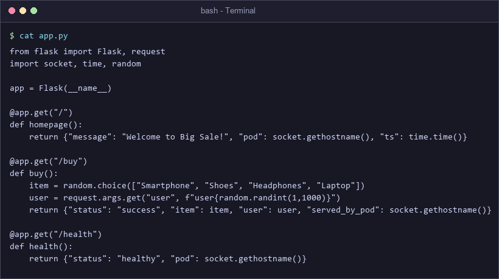
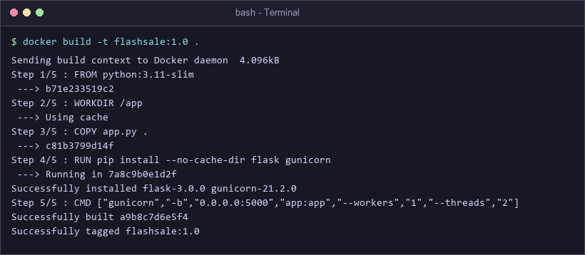
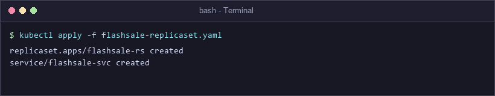
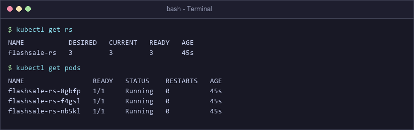
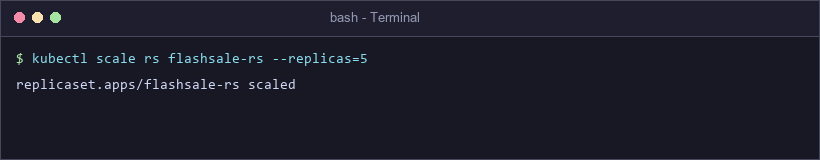
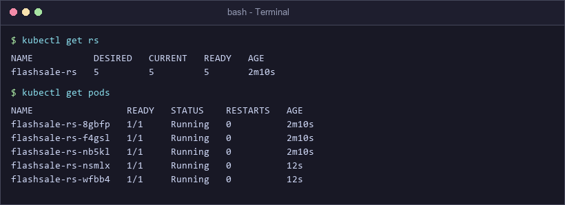
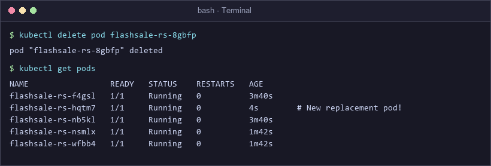
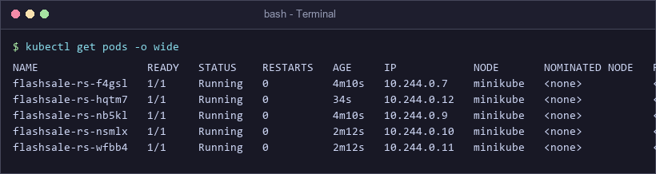
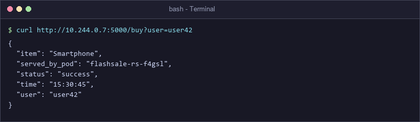

# Exercise 3: Scaling Flask App on Single Node using ReplicaSets

## 🛒 Real-Life Tech Use Case: E-Commerce Flash Sale Simulation
During peak flash sale events (such as Flipkart Big Billion Days or Amazon Prime Day):
- A single Flask service instance can normally handle ~100 requests per minute.
- Traffic surges suddenly to 10,000 requests per minute.
- If running on a single isolated Pod, the container will crash under resource exhaustion.
- Using Kubernetes **ReplicaSets**, the system horizontally scales out to 5 or 20 identical Pod clones, spreading incoming HTTP checkout traffic evenly across Pods.
- When traffic subsides after the sale, Kubernetes scales down the Pod count to optimize cloud resource usage.

---

## 🎯 Objectives
- Understand **ReplicaSets**, label selectors, and pod templates.
- Implement readiness & liveness health probes.
- Scale out Flask application instances dynamically using `kubectl scale`.
- Observe Kubernetes **self-healing** resilience upon Pod deletion.
- Inspect Pod IP distribution using `kubectl get pods -o wide`.

---

## 🚀 Step-by-Step Exercise Execution

### Step 1: Create Flash Sale Checkout Application (`app.py`)
Build a Python Flask app exposing endpoints `/` (welcome), `/buy` (simulated order checkout displaying serving Pod hostname), and `/health` (liveness probe).
```python
from flask import Flask, request
import socket, time, random

app = Flask(__name__)

@app.get("/")
def homepage():
    return {"message": "Welcome to Big Sale!", "pod": socket.gethostname(), "ts": time.time()}

@app.get("/buy")
def buy():
    item = random.choice(["Smartphone", "Shoes", "Headphones", "Laptop"])
    user = request.args.get("user", f"user{random.randint(1,1000)}")
    return {"status": "success", "item": item, "user": user, "served_by_pod": socket.gethostname()}

@app.get("/health")
def health():
    return {"status": "healthy", "pod": socket.gethostname()}
```


---

### Step 2: Create Dockerfile and Build Image
Build container image running Gunicorn WSGI server on port `5000`.
```dockerfile
FROM python:3.11-slim
WORKDIR /app
COPY app.py .
RUN pip install --no-cache-dir flask gunicorn
CMD ["gunicorn", "-b", "0.0.0.0:5000", "app:app", "--workers", "1", "--threads", "2"]
```
```bash
docker build -t flashsale:1.0 .
```


---

### Step 3: Apply ReplicaSet Manifest (`flashsale-replicaset.yaml`)
Deploy ReplicaSet requesting 3 initial replicas with readiness/liveness probes and CPU/Memory limits.
```yaml
apiVersion: apps/v1
kind: ReplicaSet
metadata:
  name: flashsale-rs
  labels:
    app: flashsale
spec:
  replicas: 3
  selector:
    matchLabels:
      app: flashsale
  template:
    metadata:
      labels:
        app: flashsale
    spec:
      containers:
      - name: flashsale-container
        image: flashsale:1.0
        ports:
        - containerPort: 5000
        readinessProbe:
          httpGet:
            path: /health
            port: 5000
          initialDelaySeconds: 2
          periodSeconds: 5
        livenessProbe:
          httpGet:
            path: /health
            port: 5000
          initialDelaySeconds: 10
          periodSeconds: 10
        resources:
          requests:
            cpu: "100m"
            memory: "128Mi"
          limits:
            cpu: "500m"
            memory: "256Mi"
---
apiVersion: v1
kind: Service
metadata:
  name: flashsale-svc
spec:
  selector:
    app: flashsale
  ports:
  - name: http
    port: 80
    targetPort: 5000
  type: ClusterIP
```
```bash
kubectl apply -f flashsale-replicaset.yaml
```


---

### Step 4: Verify Initial ReplicaSet & Pod Status
Check ReplicaSet status and ensure 3 pods are in `Running` state.
```bash
kubectl get rs
kubectl get pods
```


---

### Step 5 & 6: Horizontally Scale ReplicaSet to 5 Replicas
Simulate high-traffic flash sale scaling.
```bash
kubectl scale rs flashsale-rs --replicas=5
```


Verify updated ReplicaSet status showing 5 desired and 5 ready pods.
```bash
kubectl get rs
kubectl get pods
```


---

### Step 7: Demonstrate Kubernetes Self-Healing
Delete one running pod manually to test ReplicaSet reconciliation.
```bash
kubectl delete pod flashsale-rs-8gbfp
kubectl get pods
```

> **Observation**: Kubernetes automatically detected the missing pod and instantly created replacement pod `flashsale-rs-hqtm7` to maintain the desired count of 5 replicas.

---

### Step 8: View Pod IP Distribution Across Nodes
Inspect detailed pod status, internal IP addresses, and node placement.
```bash
kubectl get pods -o wide
```


---

### Step 9: Test Checkout Endpoint Load Balancing
Send HTTP request to `/buy` endpoint and verify serving pod identification.
```bash
curl http://10.244.0.7:5000/buy?user=user42
```


---

## ❓ Questions & Answers

**Q1: What is the initial number of replicas in the ReplicaSet?**  
*A1:* 3 replicas.

**Q2: How many pods are running after applying the ReplicaSet configuration?**  
*A2:* 3 pods.

**Q3: What happens when you scale the ReplicaSet to 5 replicas?**  
*A3:* Kubernetes control plane provisions 2 additional Pod containers to match the new desired count of 5.

**Q4: What happens when you delete one pod?**  
*A4:* The ReplicaSet controller detects the count mismatch (4 running vs 5 desired) and immediately spawns a new Pod clone to restore the desired state.

**Q5: How does Kubernetes maintain the desired number of replicas?**  
*A5:* The ReplicaSet reconciliation loop continuously monitors cluster status via the API server, comparing actual state to desired state and adjusting Pod instances accordingly.

**Q6: How many nodes are running in this cluster setup?**  
*A6:* 1 node (`minikube`).

**Q7: Where are the pods running with respect to nodes?**  
*A7:* All 5 Pod instances are running concurrently on the single `minikube` control-plane node.
