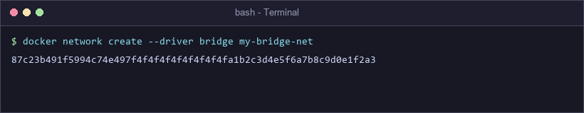
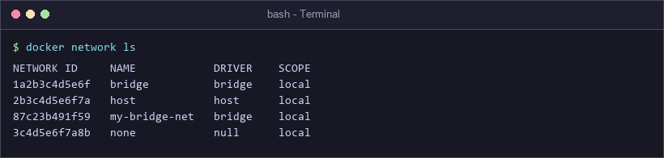
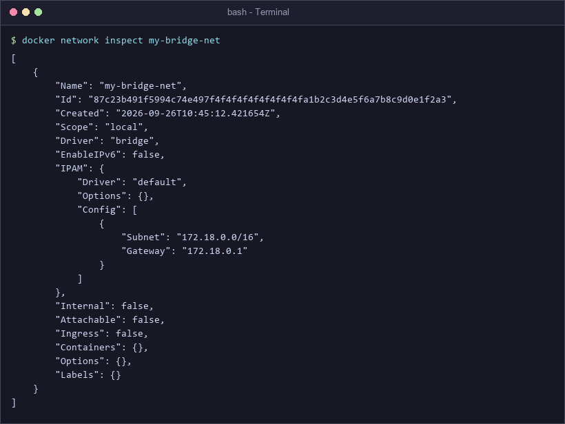
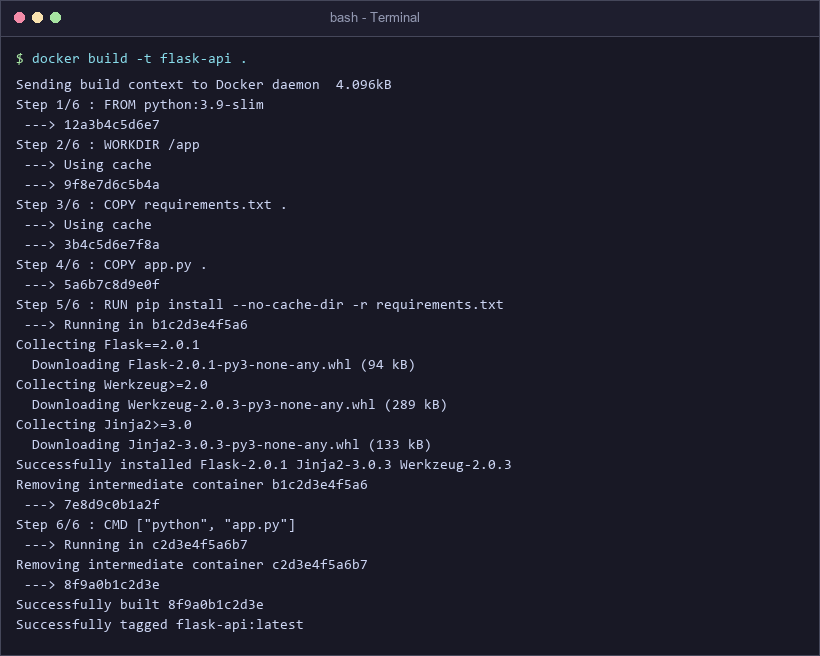
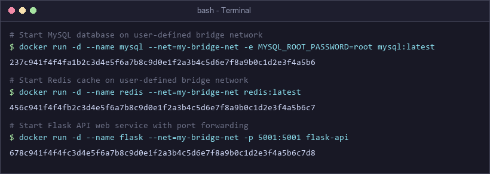
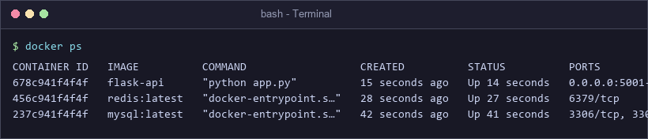
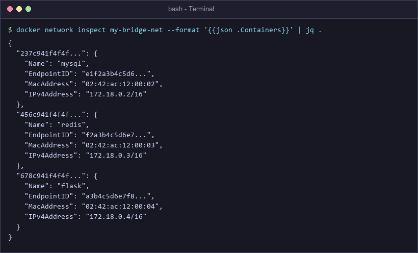
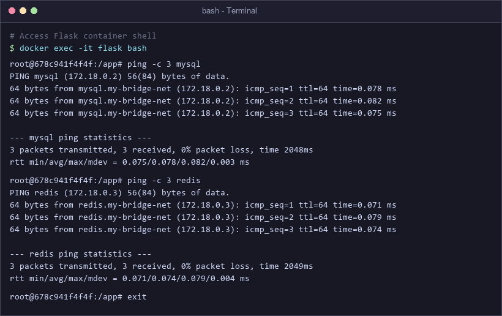
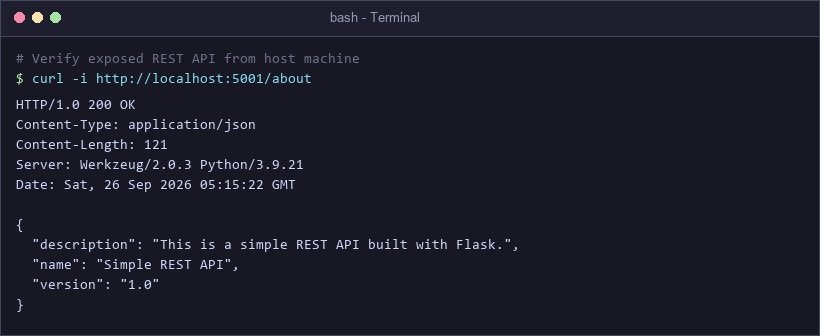
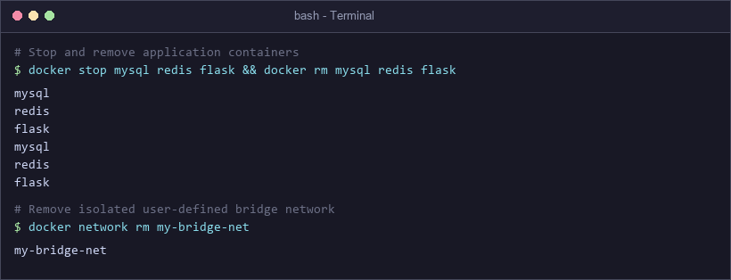

# Exercise 4: Docker Networking with Multiple Containers

## 🌐 Real-Life Tech Use Case: Multi-Tier Microservices Architecture
In modern production cloud architectures (such as banking systems, e-commerce stores, or SaaS platforms):
- Systems are decoupled into specialized microservices: a **Web/API Gateway tier** (Flask), an **in-memory Cache tier** (Redis), and a **relational persistent Database tier** (MySQL).
- **Security & Network Isolation**: Database and Cache instances should **never** be exposed directly to the public internet or external host network. Only the Web API gateway needs an exposed external ingress port (`5001`).
- **Internal Service Discovery**: Microservices must locate and communicate with each other dynamically using hostnames (`mysql`, `redis`) rather than volatile hard-coded IP addresses.
- **Docker User-Defined Bridge Networks** solve this by creating an isolated virtual software bridge with automatic **embedded DNS resolution**, network segmentation, and granular traffic security.

---

## 🎯 Objectives & Goals
- Understand core Docker network drivers (**bridge**, **host**, **none**, **overlay**).
- Create and inspect a custom user-defined bridge network (`my-bridge-net`).
- Build a custom Docker container image for a Python Flask REST API (`flask-api`).
- Run a multi-container stack consisting of Flask, MySQL, and Redis on the bridge network.
- Test container IP allocation, internal DNS name resolution, and ping packet routing.
- Expose the Flask web service port to the host and verify external REST API accessibility.
- Clean up containers and custom networks cleanly.

---

## 🛠️ Docker Networking Frequently Used Commands

| Command | Description |
| :--- | :--- |
| `docker network ls` | List all existing Docker networks on the host |
| `docker network create --driver <driver> <net-name>` | Create a new user-defined network |
| `docker network inspect <net-name>` | View detailed JSON configuration, subnet, gateway, and connected containers |
| `docker network connect <net-name> <container>` | Connect an active container to an additional network |
| `docker network disconnect <net-name> <container>` | Disconnect a container from a specified network |
| `docker network rm <net-name>` | Remove one or more user-defined networks |
| `docker network prune` | Remove all unused networks |

---

## 🚀 Step-by-Step Exercise Execution

### Step 1: Create a Custom Bridge Network
Create an isolated user-defined bridge network named `my-bridge-net`.
```bash
docker network create --driver bridge my-bridge-net
```


---

### Step 2: Verify the Created Network
List all Docker networks to verify `my-bridge-net` is active alongside default networks (`bridge`, `host`, `none`).
```bash
docker network ls
```


---

### Step 3: Inspect Network Subnet & Gateway
Inspect `my-bridge-net` to observe IPAM subnet allocation (`172.18.0.0/16`) and virtual gateway (`172.18.0.1`).
```bash
docker network inspect my-bridge-net
```


---

### Step 4: Create and Build the Flask API Container Image
Create the microservice files (`app.py`, `requirements.txt`, `Dockerfile`) and build the container image.

#### Python Flask Application (`app.py`)
```python
from flask import Flask, jsonify

app = Flask(__name__)

@app.route('/about', methods=['GET'])
def about():
    return jsonify({
        "name": "Simple REST API",
        "version": "1.0",
        "description": "This is a simple REST API built with Flask."
    })

if __name__ == '__main__':
    # Listen on all container network interfaces
    app.run(host='0.0.0.0', debug=True, port=5001)
```

#### Dependencies (`requirements.txt`)
```
Flask==2.0.1
```

#### Containerfile (`Dockerfile`)
```dockerfile
# Use the official Python image from the Docker Hub
FROM python:3.9-slim

# Set the working directory in the container
WORKDIR /app

# Copy the requirements file and app code to the container
COPY requirements.txt .
COPY app.py .

# Install Flask (and any other dependencies you might have)
RUN pip install --no-cache-dir -r requirements.txt

# Expose the port the app runs on
EXPOSE 5001

# Define the command to run the application
CMD ["python", "app.py"]
```

#### Build Image
```bash
docker build -t flask-api .
```


---

### Step 5: Launch Containers on `my-bridge-net`
Run MySQL, Redis, and Flask containers attached to the user-defined bridge network `my-bridge-net`. Notice only Flask publishes an external port mapping (`-p 5001:5001`), protecting the data stores from external access.
```bash
# Start MySQL database
docker run -d --name mysql --net=my-bridge-net -e MYSQL_ROOT_PASSWORD=root mysql:latest

# Start Redis in-memory cache
docker run -d --name redis --net=my-bridge-net redis:latest

# Start Flask API web service
docker run -d --name flask --net=my-bridge-net -p 5001:5001 flask-api
```


---

### Step 6: Verify Active Running Containers
Verify that all 3 containers are running in the background and confirm their respective port allocations.
```bash
docker ps
```


---

### Step 7: Inspect Connected Containers & Assigned IPs
Inspect `my-bridge-net` to verify the internal IP address assigned to each container by Docker's embedded DHCP server.
```bash
docker network inspect my-bridge-net --format '{{json .Containers}}' | jq .
```
- **MySQL**: `172.18.0.2`
- **Redis**: `172.18.0.3`
- **Flask**: `172.18.0.4`



---

### Step 8: Test Inter-Container DNS Resolution & Connectivity
Open an interactive bash terminal inside the running `flask` container and ping `mysql` and `redis` by hostname.
```bash
docker exec -it flask bash
ping -c 3 mysql
ping -c 3 redis
exit
```

> **Observation**: Automatic DNS name resolution succeeds! On user-defined bridge networks, Docker's embedded DNS server (`127.0.0.11`) maps container names directly to their assigned internal IPs without requiring `/etc/hosts` modifications.

---

### Step 9: Verify External REST API Ingress Access
From the host machine, send an HTTP GET request to test the exposed Flask API endpoint.
```bash
curl -i http://localhost:5001/about
```


---

### Step 10: Clean Up Containers & Network
Gracefully stop and remove the running containers, then delete the custom bridge network.
```bash
# Stop and remove containers
docker stop mysql redis flask && docker rm mysql redis flask

# Remove custom bridge network
docker network rm my-bridge-net
```


---

## 📐 Network Architecture & Packet Flow Topology

```
+-----------------------------------------------------------------------------------------+
|                                    HOST MACHINE                                         |
|                                                                                         |
|   Client / Browser / curl                                                               |
|        |                                                                                |
|        | HTTP Request: http://localhost:5001/about                                      |
|        v                                                                                |
|   [ Host Port 5001 ]                                                                    |
|        |                                                                                |
|        | (iptables NAT Port Forwarding: 0.0.0.0:5001 -> 172.18.0.4:5001)                |
|        v                                                                                |
|   +---------------------------------------------------------------------------------+   |
|   |                  DOCKER USER-DEFINED BRIDGE: my-bridge-net                      |   |
|   |                            Subnet: 172.18.0.0/16                                |   |
|   |                            Gateway: 172.18.0.1                                  |   |
|   |                            DNS Server: 127.0.0.11                               |   |
|   |                                                                                 |   |
|   |   +---------------------+   Internal DNS   +--------------------------------+   |   |
|   |   |   CONTAINER: flask  | ---------------->|       CONTAINER: mysql         |   |   |
|   |   |   IP: 172.18.0.4    |   Name: 'mysql'  |       IP: 172.18.0.2           |   |   |
|   |   |   Port: 5001 (open) |                  |       Port: 3306 (internal)   |   |   |
|   |   +---------------------+                  +--------------------------------+   |   |
|   |              |                                                                  |   |
|   |              | Internal DNS ('redis')                                           |   |
|   |              v                                                                  |   |
|   |   +---------------------+                                                       |   |
|   |   |   CONTAINER: redis  |                                                       |   |
|   |   |   IP: 172.18.0.3    |                                                       |   |
|   |   |   Port: 6379 (int)  |                                                       |   |
|   |   +---------------------+                                                       |   |
|   +---------------------------------------------------------------------------------+   |
+-----------------------------------------------------------------------------------------+
```

---

## 📄 Declarative Multi-Container Compose Alternative (`docker-compose.yml`)
Instead of executing sequential manual imperative `docker run` commands, the entire multi-tier stack can be orchestrated declaratively using Docker Compose:

```yaml
version: '3.8'

services:
  mysql:
    image: mysql:latest
    container_name: mysql
    environment:
      MYSQL_ROOT_PASSWORD: root
    networks:
      - my-bridge-net

  redis:
    image: redis:latest
    container_name: redis
    networks:
      - my-bridge-net

  flask:
    build: .
    image: flask-api:latest
    container_name: flask
    ports:
      - "5001:5001"
    depends_on:
      - mysql
      - redis
    networks:
      - my-bridge-net

networks:
  my-bridge-net:
    driver: bridge
```

To deploy with one command:
```bash
docker compose up -d
```
To tear down:
```bash
docker compose down
```

---

## ❓ Questions & In-Depth Technical Answers

### Q1: What is the purpose of the `--net` (or `--network`) flag in `docker run`?
**Answer**:
The `--net` flag assigns a container to a specific Docker network at launch time. By attaching multiple containers to the same network (e.g., `--net=my-bridge-net`), Docker:
1. Places all connected containers within the same virtual network namespace and IP subnet (`172.18.0.0/16`).
2. Configures routes enabling containers to send bidirectional IP packets directly to one another.
3. Isolates traffic from containers residing on other networks or the default bridge.

### Q2: How do containers communicate with each other on the same network?
**Answer**:
Containers communicate using:
1. **Automatic DNS Name Resolution**: On user-defined bridge networks, Docker runs an embedded DNS resolver at `127.0.0.11`. When container `flask` attempts to contact `mysql`, Docker's DNS server automatically resolves the hostname `mysql` to its internal IP address (`172.18.0.2`).
2. **Direct IP Addressing**: Containers can also communicate directly using their assigned internal IPv4 addresses on the shared subnet.
3. **Internal Port Access**: All ports exposed by containers (e.g. 3306 for MySQL, 6379 for Redis) are fully reachable by peer containers on the same network without needing host port mapping (`-p`).

### Q3: What is the difference between a Bridge network and a Host network?
**Answer**:

| Feature | Bridge Network (`--net=bridge` / custom) | Host Network (`--net=host`) |
| :--- | :--- | :--- |
| **Network Namespace** | Isolated virtual network namespace per container | Shares host machine's network stack directly |
| **IP Address** | Unique virtual private IP (e.g., `172.18.0.x`) | Same IP address as the physical host |
| **Port Mapping** | Requires explicit port forwarding (`-p host:container`) | Binds directly to host ports (no `-p` needed) |
| **Port Conflicts** | Multiple containers can listen on port `5001` internally | Port collision occurs if two containers bind same port |
| **Security Isolation**| High isolation; internal traffic is shielded | Low isolation; bypasses Docker firewall boundaries |
| **Analogy** | Containers are in separate rooms communicating via private doors | Containers are in the living room sharing the host table |

### Q4: How can you expose a container's port to the host machine?
**Answer**:
You expose a container port to the host using the `-p` (or `--publish`) flag during `docker run`:
```bash
docker run -p <HOST_PORT>:<CONTAINER_PORT> <IMAGE>
```
For example:
```bash
docker run -p 5001:5001 flask-api
```
- Docker configures host network `iptables` NAT rules that forward incoming TCP traffic arriving at host port `5001` directly to port `5001` within the `flask` container's private virtual network interface.
- You can also bind to specific host interfaces, e.g., `-p 127.0.0.1:5001:5001` to restrict access strictly to localhost.

### Comparison: Default Bridge vs. User-Defined Bridge
| Feature | Default Bridge (`bridge`) | User-Defined Bridge (`my-bridge-net`) |
| :--- | :--- | :--- |
| **Automatic DNS Resolution** | ❌ No (requires deprecated `--link` or raw IP) | ✅ Yes (resolves container names automatically) |
| **Network Isolation** | ❌ All unconfigured containers share it | ✅ Secure isolation between unrelated apps |
| **Live Connect/Disconnect** | ❌ Containers cannot be disconnected while running | ✅ Supports dynamic `docker network connect/disconnect` |
| **Environment Configuration** | ❌ Static system defaults | ✅ Custom subnets, MTU, and gateway configurable |
